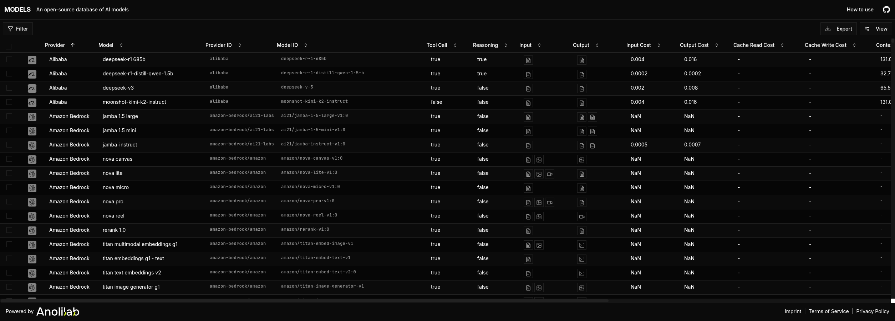

# AI Models - An Open-Source Database of AI Models

<div align="center">
  

This project is a comprehensive, open-source platform that provides a unified database of AI models from 50+ providers. It consists of a powerful TypeScript library for accessing model metadata and a modern web application for browsing and searching AI models.

</div>

---

<div align="center">
    <p>
        <sup>
            Anolilab's open source work is supported by the community on <a href="https://github.com/sponsors/anolilab">GitHub Sponsors</a>
        </sup>
    </p>
</div>

---

This is a monorepo that contains a collection of packages providing comprehensive AI model data and a modern web interface for browsing and searching AI models.

## Usage

Check the README for each package within the `packages` directory for specific usage instructions.

## Featured Packages

| Tool                                                                     | Package                                                                                                                             | Version                                                                                                                         | Description                                                                                                                                     |
|--------------------------------------------------------------------------|-------------------------------------------------------------------------------------------------------------------------------------|---------------------------------------------------------------------------------------------------------------------------------|-------------------------------------------------------------------------------------------------------------------------------------------------|
| [AI Model Registry](https://github.com/anolilab/ai-models)              | [@anolilab/ai-model-registry](https://github.com/anolilab/ai-models/blob/main/packages/ai-model-registry/README.md)                |        | A comprehensive TypeScript library providing access to AI model metadata from 50+ providers with pricing data and advanced search capabilities. |
| [Web Application](https://github.com/anolilab/ai-models)                | [web](https://github.com/anolilab/ai-models/blob/main/web/README.md)                                                               |                                                            | A modern React web application built with TanStack Start for browsing and searching AI models with advanced filtering and data export.         |

## Features

### 🌐 Web Application
- **📊 Interactive Data Table**: Browse 1000+ AI models with advanced filtering and sorting
- **🔍 Powerful Search**: Search by provider, capabilities, pricing, and more
- **📱 Responsive Design**: Works seamlessly on desktop and mobile devices
- **🎨 Modern UI**: Built with TailwindCSS and shadcn/ui components
- **⚡ Fast Performance**: Optimized with TanStack Table and virtual scrolling
- **📤 Data Export**: Export filtered data in various formats

### 📦 AI Model Registry Library
- **🔄 Unified Interface**: Access models from multiple providers through a single API
- **🛡️ Type Safety**: Full TypeScript support with Zod schema validation
- **📦 Tree Shaking**: Import only what you need to minimize bundle size
- **💰 Rich Metadata**: Comprehensive model information including capabilities, pricing, and limits
- **🔍 Advanced Search**: Powerful search and filtering capabilities across all models
- **🔄 Auto-Sync**: Automatic data synchronization between models with the same ID
- **💸 Pricing Integration**: Real-time pricing data from Helicone API (840+ models)

## Quick Start

### Prerequisites

- Node.js 22+
- pnpm (recommended) or npm

### Installation

```bash
# Clone the repository
git clone https://github.com/anolilab/ai-models.git
cd ai-models

# Install dependencies
pnpm install
```

### Development

```bash
cd packages/ai-model-registry

pnpm run prepare-data
pnpm run build

# WEB App

cd web

pnpm run dev
```

Open [http://localhost:3000](http://localhost:3000) in your browser to see the web application.

## How We Version

We use [SemVer](https://semver.org/) for its versioning providing us an opt-in approach to releases.
This means we add a version number according to the spec, as you see below.
So rather than force developers to consume the latest and greatest, they can choose which version to consume and test any newer ones before upgrading.
Please the read the spec as it goes into further detail.

## Supported Node.js Versions

Libraries in this ecosystem make the best effort to track
[Node.js' release schedule](https://nodejs.org/en/about/releases/). Here's [a
post on why we think this is important](https://medium.com/the-node-js-collection/maintainers-should-consider-following-node-js-release-schedule-ab08ed4de71a).

## Contributing

If you would like to help take a look at the [list of issues](https://github.com/anolilab/ai-models/issues) and check our [Contributing](.github/CONTRIBUTING.md) guide.

> **Note:** please note that this project is released with a Contributor Code of Conduct. By participating in this project you agree to abide by its terms.

## Credits

- [Daniel Bannert](https://github.com/prisis)
- [All Contributors](https://github.com/anolilab/ai-models/graphs/contributors)

## License

The anolilab ai-models is open-sourced software licensed under the [Apache License 2.0](https://opensource.org/licenses/Apache-2.0)

[repository]: https://github.com/anolilab/ai-models
